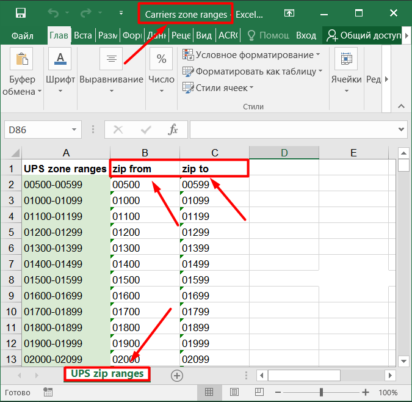

# Zip Code File Collector

This program is used for collecting domestic zones source files using [www.ups.com](https://www.ups.com/us/en/support/shipping-support/shipping-costs-rates/retail-rates.page) source and
saving files in .xlsx format.

It includes 2 versions: synchronous and asynchronous.

The synchronous execution time is more than 300 seconds and the asynchronous version can 
run up to 4 times faster with range checking and almost 50 times faster without range 
checking (Up to 10 seconds execution time)!

Also, a block of code that contains a range check should be rewritten in an 
asynchronous way.


## Installing using Github
```shell
git clone https://github.com/taras-andruschenko/UPS-Zip-Code-File-Collector.git
python -m venv venv
source venv/bin/activate
pip install -r requirements.txt
```
#### for async version:
```shell
python -m asynchronous.main
```
#### for sync version:
```shell
python -m synchronous.main
```

After the program ends, you can find the collected files in the folder `zip_files`

Note: ZONE_RANGES_FILE_NAME, COLUMN_FROM, COLUMN_TO and 
SHEET may be reassigned in config.py according to your initial data!

For example, in the screenshot above you can find your initial data (marked with arrows)


